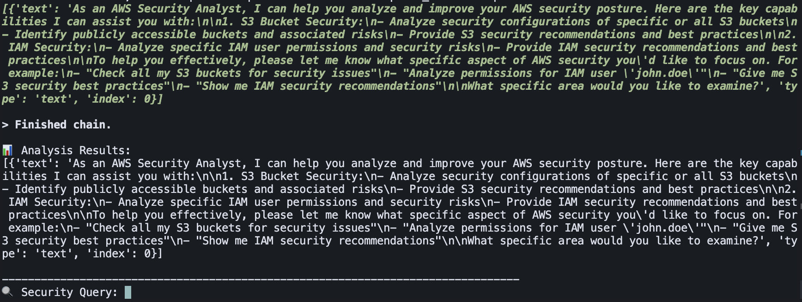

The project revolves around a natural language chatbot that is capable of answering questions about an AWS account. 

Using the LangChain framework [LangChain Docs](https://python.langchain.com/docs/introduction/) and adding various AWS APIs in the form of custom Tools [LangChain Tools](https://python.langchain.com/docs/modules/agents/tools/custom_tools).

## Summary
A natural language chatbot that answers prompted questions for a given Cloud provider account. 
Run the bot at the CLI 

Prerequisites 
- Having credentials for any chat based LLM that LanhChain supports. 
- Having authorized AWS credentials through an .env file or through named profiles. 
[Named Profiles](https://docs.aws.amazon.com/cli/v1/userguide/cli-configure-files.html#cli-configure-files-using-profiles)

For getting an overview of the system design and file structure, run the `tree` command output.

## Getting Started 

Fork the repository and clone your fork to your local machine.

Create a new branch for your changes:
`git checkout -b your-branch`

Install requirements
`pip install requirements.txt`

Can also choose to isolate further with a Conda environment
### Activate conda base environment
`source ~/miniconda3/bin/activate base`
[Conda Docs](https://docs.conda.io/projects/conda/en/stable/user-guide/tasks/manage-environments.html)

Run the main script 

Some example questions it should be able to answer are 
- EC2 Instance Details: Type, state, volume size, architecture.
- Analyze the S3 buckets in <given account>
- Are there any S3 buckets exposed to the public?
- What permissions does `<a given IAM user have >`

### Here is sample help output for the bot

<picture>
    <source media"(prefers-color-schema: dark)" srcset="./images/cloud_bot_help_Response.png">
    
</picture>

Future Additions
- Support for GCP 
- Support for Azure

## References 

https://boto3.amazonaws.com/v1/documentation/api/latest/guide/quickstart.html#using-boto3
https://docs.aws.amazon.com/cli/latest/reference/ec2/describe-tags.html
https://docs.aws.amazon.com/cli/latest/reference/s3api/

[AWS Named Profiles](https://docs.aws.amazon.com/cli/v1/userguide/cli-configure-files.html#cli-configure-files-using-profiles)

[LangChain Tools](https://python.langchain.com/docs/modules/agents/tools/custom_tools)